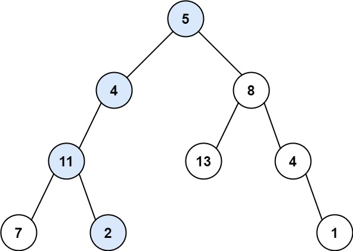

# 路径总和

## 题目要求

给你二叉树的根节点 root 和一个表示目标和的整数 targetSum  
判断该树中是否存在 根节点到叶子节点 的路径，这条路径上所有节点值相加等于目标和 targetSum  
如果存在，返回 true ；否则，返回 false



### 示例

```js
// 输入
root = [5,4,8,11,null,13,4,7,2,null,null,null,1], targetSum = 22
// 输出：
true
// 解释：
等于目标和的根节点到叶节点路径如上图所示
```

## 思路

简单题，最普通的写法就是深度优先遍历呗，每棵树到最后的叶子节点都计算下和  
但这道题可以用一下回溯  
比如，到某一个节点的父节点，如果父节点的左节点计算的sum不等于目标值，可以回退结果到父节点，再计算右节点的值，这样可以避免从头计算整个子树

```js
/**
 * Definition for a binary tree node.
 * function TreeNode(val, left, right) {
 *     this.val = (val===undefined ? 0 : val)
 *     this.left = (left===undefined ? null : left)
 *     this.right = (right===undefined ? null : right)
 * }
 */
/**
 * @param {TreeNode} root
 * @param {number} targetSum
 * @return {boolean}
 */
var hasPathSum = function(root, targetSum) {
    let sum = 0
    let res = false

    const dfs = (node = (new TreeNode)) => {
        if (!node) return
        if (res) return

        sum += node.val
        if (node.left) {
            dfs(node.left)
        }

        if (node.right) {
            dfs(node.right)
        }

        if (sum === targetSum && !node.left && !node.right) res = true
        sum -= node.val
    }

    dfs(root)

    return res
};
```
